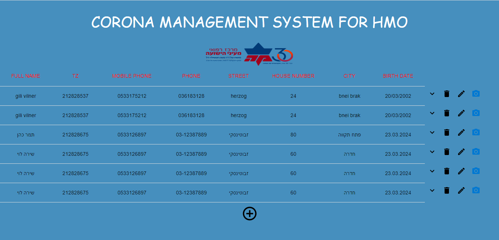
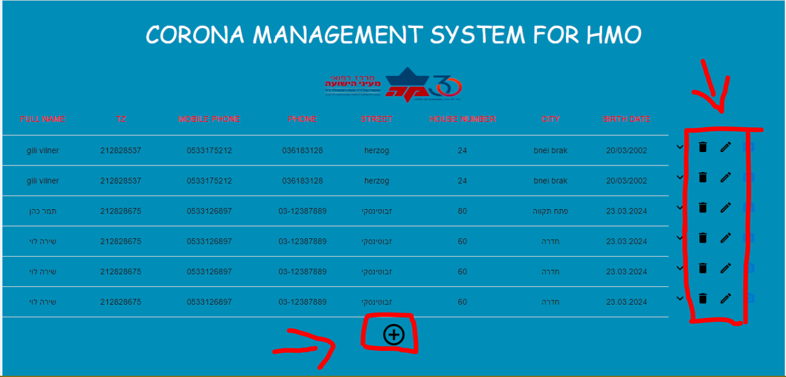
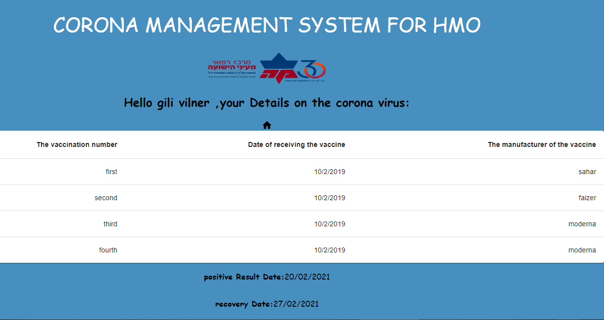

In this project I implemented a FullStack system to manage the Corona database
for a large health fund. The system will display the members at the checkout
the patients, allow their editing and deletion, and manage the records
in a database. Also, the system will store key information about an epidemic
The corona virus in the context of members of the health fund. To this database they will be able to
In the future, apply for the purpose of carrying out various withdrawals.

he system displays a list of all members
in the health fund entered into the system (manual entry), and when choosing
In one of them, open his card and display different data.
For each HMO member, details will be displayed regarding the date of receipt
His corona vaccinations, the date he was sick (if any) and the date
his recovery.

תלויות  חיצוניות-external dependencies:
The project consists of a server side and a client side
to run it
React must be run with the npm start command
And also java by clicking on the green arrow on the top left.